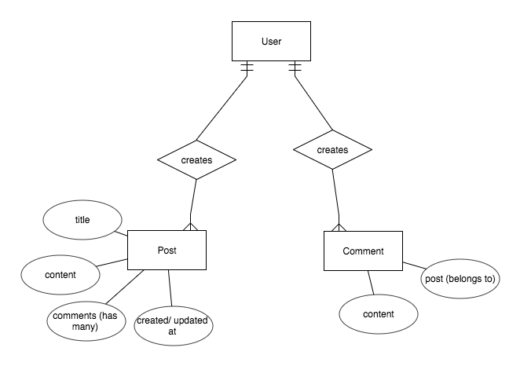

# Welcome to Wander

Wander is a ~~social network~~ blogging platform that intends to give travellers a place to share their travels, suggestions and experiences with a community of fellow explorers. Blog posts may be commented on and all CRUD actions are possible. For this iteration, comments may only be created.  As of right now, these are the only features [but there will be many more to come](#future-releases)

[Link to API deployed via Heroku](https://dreadful-citadel-51922.herokuapp.com/)
[Link to Client deployed via GH pages](https://mattgoldman93.github.io/wander-app-client/#/posts)
[Link to client repo](https://github.com/Mattgoldman93/wander-app-client)

## Development Process
  I approached this project differently than I had approached my others throughout this course. I knew what I wanted the end result to be and I realized that it was an ambitious undertaking. I also planned on using the ember framework, with which I was not entirely familiar, for my client side. This added an additional level of difficulty. Before starting the project, I researched several ruby gems to be used in my API and several ember add-ons to be used on the client side. I believed that by using these add-ons I could avoid "reinventing the wheel" and would be able to reach my goals faster. Unfortunately, this was not the case. Fitting these gems and add-ons to my specific use cases was much more challenging than I imagined and this fact was only exacerbated by my failure to carefully plan out this project and how I would achieve the end product I wanted to. Instead of creating a minimum viable product to meet requirements, I attemptepted to dive right in and figure out what worked and what didn't as I went along. **This was a huge mistake**. Additionally, I failed to follow the tried and true suggested schedule provided by GA and affirmed through many past projects. Eventually, I decided to abandon the use of any add-ons or gems and the result was an end product that fell far short of my intended goal of creating something of a social network. Nevertheless, there will be future iterations and given more time I hope to be able to figure out and implement add-ons and gems that will create a richer user experience.

  To build the back-end, I attempted to loosely follow [this blog post](https://medium.com/rails-ember-beyond/how-to-build-a-social-network-using-rails-eb31da569233). It outlined and explained implementing several ruby gems including [carrierwave](https://github.com/carrierwaveuploader/carrierwave) for attaching files to posts, [acts_as_votable](https://github.com/ryanto/acts_as_votable) for implementing 'likes' on posts, and [acts_as_commentable](https://github.com/jackdempsey/acts_as_commentable) for comments. The guide did not prove useful for my purposes and I could not figure out how to properly implement these gems.
  The first day was spent following this guide while setting up the back end. The result was many unused files and unecessary migrations, which led to some difficulties when deploying to heroku. The back end was mostly complete by the end of the first day. The second day was primarily spent on hooking up the front end. Day three was spent mainly trying to allow users to post photos, I decided not to user carrier wave and instead use an ember add on. On the backend, though, I needed to integrate S3 as well as a sign route to validate the uploads. I was not able to get this working. Later, I needed to create a couple of migrations in order to add a title section to posts and also reference comments when that table was created on day 4.
  A lot of time was spent on days 5 and 6 trying to get comments to be stored with all the needed information. I was trying to solve this by making tweeks on the front end but, as it turned out, the problem was with the serializer. The serializer was returning the entire post object under comments and an array of entire comment objects within posts. This was solved by having the post serializer pluck the comment ids and having comments store only the post id. On day 4 I had also generated files for a favorites feature that would let users save and access their favorite posts. I later opted to focus on a comments feature (built without acts_as_commentable) instead. I do plan to implement the favorites feature in the future but for now the contents of those files are commented out.
  ## Technologies used
  Technologies used included Ruby on Rails and Heroku. More technologies will be added in the future to improve functionality. As it stands, however, there are no dependencies necessary.

  ## Future Releases
  There are many more features I would like to implement in future release. A few of these have been implied in my description of the development process, namely the ability to 'favorite' posts and add photos to posts. Additionally, I would like to allow users to follow other users and see 3 feeds: all posts, followed posts, and owned posts. I want the update and delete buttons to only appear if the post is owned by the current user. I would also like to make posts more structured, e.g having fields for things such as suggested places to eat and stay, tips, places to stay away from etc. I would also like users to pin places on google maps and embed maps within a post. Another feature that I may implement much further down the road is a Map View, where users can find posts by selecting pins on a map. Probably the first addition I'd like to make, though, is allowing all CRUD actions on comments.
  ## Enitity Relationship Diagram
  

  ### API end-points

  | Verb | URI Pattern | Controller#Action |
  | ---- | ----------- | ----------------- |
  | POST   | `/sign-up`  | `users#signup` |
  | POST   | `/sign-in`  | `users#signin` |
  | DELETE | `/sign-out/:id` | `users#signout`  |
  | PATCH   | `/change-password/:id`  | `users#changepw` |
  | GET   | `/posts`  | `posts#index` |
  | GET   | `/posts/:id` |  `post#show` |
  | POST   | `/posts`  | `post#create`  |
  | PUT   | `/posts/:id`  | `post#update` |
  | DELETE   | `/posts/:id`  | `uploads#destroy` |
  | POST   |  `/comments`  |  `comments#create` |   
